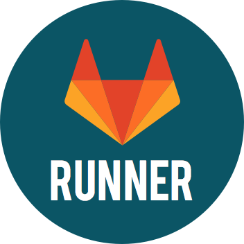
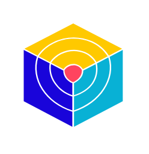

<!--
**PedroIeremis/PedroIeremis** is a ✨ _special_ ✨ repository because its `README.md` (this file) appears on your GitHub profile.

Here are some ideas to get you started:

- 🔭 I’m currently working on ...
- 🌱 I’m currently learning ...
- 👯 I’m looking to collaborate on ...
- 🤔 I’m looking for help with ...
- 💬 Ask me about ...
- 📫 How to reach me: ...
- 😄 Pronouns: ...
- ⚡ Fun fact: ...
-->

### Olá, eu sou Pedro Iéremis! 👋

---

  
Tenho 22 anos de idade. Resido em Natal/RN. Sou graduado em Redes de Computadores pelo <a href="https://portal.ifrn.edu.br/cursos/superiores/graduacao/tecnologia-em-redes-de-computadores/" target="_blank">IFRN Natal Central</a>. Atualmente trabalho na Natal Computer, atuando como Engenheiro de Infraestrutura e DevOps, além de prestar consutoria nessa área de Tecnologia da Informação.  Minhas experiências podem ser melhor vistas em meu <a href="www.linkedin.com/in/pedroieremis" target="_blank">Linkedin</a> ou no meu Site Profile, com link no meu perfil ou <a href="https://pedroieremis.eti.br/" target="_blank">aqui</a>.

  
  

  <h4>Tecnologias, ferramentas e linguagens de programação conhecidas e em aprendizado</h4>
  
  
  
  
  
  
  
  
  
  
  
  
  
  
  
  
  
  

---

  
   
  

### ***Visitas ao Perfil***

<!---
 

--->
